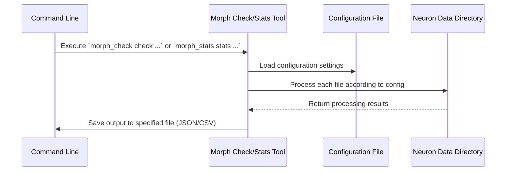

# Chapter 1: Command-Line Interface (CLI) for NeuroData Analysis

Welcome to our journey into using command-line interfaces (CLI) for neurodata analysis. In the previous chapter, we explored basic concepts of data manipulation and visualization tools in Python. Now, we'll transition into a powerful way to handle large-scale neurodata efficiently using CLI.

## Motivation: Streamlining Data Processing with CLIs

Imagine you are working on a neuroscience project involving hundreds of neuron morphology files. You need to perform various checks and compute statistics for each file. Doing this manually or through scripts can be cumbersome, error-prone, and time-consuming. Here is where the Command-Line Interface (CLI) shines by providing automated tools to streamline these tasks.

### Key Concepts

To understand how CLI can solve your data processing problems, we'll break it down into a few key concepts:

1. **Automation**: CLIs automate repetitive tasks with predefined commands.
2. **Scalability**: They handle large datasets efficiently without manual intervention.
3. **Flexibility**: Customize and extend functionality through configuration files.

### Using CLI for NeuroData Analysis

Let's dive into how you can use a CLI to check neuron morphology data:

#### Example Use Case: Performing Checks on Morphologies

Suppose you have a directory filled with morphological data of neurons, and you want to ensure they meet certain criteria (like having no missing branches). Here's how you'd do it using the `check` command from our neurodata CLI tool.

```bash
# Check morphologies in the 'neuron_data' directory
morph_check check neuron_data -C example_config.json -o output_summary.json
```

- **Input**: Directory `neuron_data`, configuration file `example_config.json`.
- **Output**: JSON summary report `output_summary.json` detailing checks performed.

The command above tells our CLI tool to perform predefined checks on all files in the directory using settings from `example_config.json` and save a summary report as `output_summary.json`.

#### Example Use Case: Computing Statistics

Now, let's compute statistics for neuron types. This is useful when you want to analyze features like total length or branching angles across your dataset.

```bash
# Compute statistics for data in 'neuron_data' directory
morph_stats stats neuron_data -C stats_config.json -o results.csv
```

- **Input**: Directory `neuron_data`, configuration file `stats_config.json`.
- **Output**: CSV file `results.csv` with computed statistics.

This command processes each file according to the rules defined in `stats_config.json` and outputs a summary of the statistics into a CSV file for easy analysis.

### Internal Implementation: What Happens Under the Hood?

When you run these commands, here's what happens step-by-step:

1. **Command Parsing**: The CLI tool interprets the command and its options (like `-C` for config file).
2. **Configuration Loading**: It loads settings from your configuration file.
3. **File Processing**:
   - For `check`: Validates each file against criteria in the config.
   - For `stats`: Computes specified statistics on each file.
4. **Output Generation**: Results are compiled and saved to the output file.

Here's a simplified sequence diagram illustrating these steps:



### Deep Dive into Implementation

To understand how these commands are implemented, let's look at the core functions:

- **Command Parsing**: Uses libraries like `argparse` in Python to handle command-line arguments.
  ```python
  import argparse

  parser = argparse.ArgumentParser(description='Neurodata CLI Tool')
  parser.add_argument('datapath', help='Path to data directory')
  parser.add_argument('-C', '--config', help='Configuration file path', required=True)
  parser.add_argument('-o', '--output', help='Output file path', required=True)

  args = parser.parse_args()
  ```

- **File Processing**: Iterates through each file, performing checks or computations as configured.
  
  For example, in `morph_check`:
  ```python
  def perform_checks(file_path, config):
      # Load and validate morphology data according to rules in config
      pass

  for file in data_directory:
      perform_checks(file, config)
  ```

- **Output Generation**: Uses Python's built-in libraries like `json` or `csv` to write results.
  
  ```python
  import json

  def save_output(data, output_path):
      with open(output_path, 'w') as f:
          json.dump(data, f)

  save_output(results_summary, args.output)
  ```

## Conclusion

With this chapter, you've learned how to harness the power of CLIs for neurodata analysis. By automating checks and statistics computations, you can focus on interpreting results rather than manually processing data. In the next chapter, we will delve deeper into customizing these tools to suit specific research needs.

Stay tuned as we continue our exploration into efficient data handling techniques!

---

Generated by [AI Codebase Knowledge Builder](https://github.com/The-Pocket/Tutorial-Codebase-Knowledge)