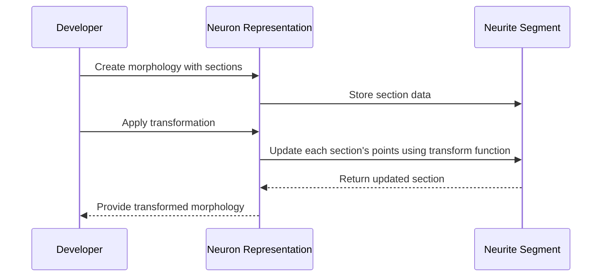

# Chapter 2: Morphology Representation

In our journey through understanding neural structures in computational neuroscience, we've previously explored basic neuron anatomy and how these tiny biological units form the foundation of complex brain networks. Now, as we transition into this chapter, we delve deeper into representing these intricate structures programmatically—a crucial step for researchers and enthusiasts working with neural simulations.

## Understanding Morphology

Imagine a tree: its branches stretch out in various directions, each branch having smaller twigs and leaves at different points. This natural structure is akin to a neuron's morphology—the way neurons connect and extend throughout the brain. In computational terms, this intricate network needs a robust representation to allow scientists to study and simulate neural behavior effectively.

### Key Concepts

To simplify our understanding of how we can represent neuronal structures programmatically, let's break down the key concepts:

1. **Neurite**: A neurite is a projection from the neuron's cell body, like an axon or dendrite. Think of it as a branch of our tree analogy.

2. **Section**: Within each neurite, there are segments called sections. These can be visualized as smaller branches and twigs on our metaphorical tree.

3. **Segment**: Each section is composed of several points in 3D space that form what we call a segment. If you imagine connecting these points with straight lines, you get the shape of each segment.

4. **Soma**: The soma represents the neuron's cell body—the trunk of our tree from which all branches (neurites) originate.

5. **Morphology Class**: This is where everything comes together in code. It provides a structured way to store and manipulate information about neurons, including their soma, neurites, sections, and segments.

## Using the Morphology Abstraction

To help you get started with using these concepts, let's walk through an example of how to create and interact with a `Morphology` object in Python. This will guide you on representing a neuron's structure and performing basic operations like transformation.

### Creating a Simple Neuron Representation

Let's start by creating a simple representation of a neuron:

```python
# Import the Morphology class from the library
from morpholib import Morphology, Section

# Create sections for our neuron
section1 = Section(id=1, points=[[0, 0, 0], [10, 10, 0]])
section2 = Section(id=2, points=[[10, 10, 0], [20, 5, 5]])

# Initialize a Morphology object with these sections
neuron_morphology = Morphology(sections=[section1, section2])

print(neuron_morphology)
```

**Explanation**: In this code snippet, we define two sections that represent parts of our neuron's neurites. These sections are then used to create a `Morphology` object representing the entire neuron.

### Applying Transformations

Neurons often need to be transformed in space for simulations—rotated, translated, or scaled. Let's see how this is done:

```python
import numpy as np

def translate(points, vector):
    return points + vector

# Define a translation vector
translation_vector = np.array([5, 0, 0])

# Apply the transformation to our neuron morphology
transformed_neuron = neuron_morphology.transform(translate)

print(transformed_neuron)
```

**Explanation**: Here, we define a simple `translate` function that shifts each point in the neuron by a specified vector. The `Morphology` class's `transform` method is then used to apply this transformation.

## Internal Implementation Walkthrough

To understand how these operations work under the hood, let's break down what happens when you call methods on our `Morphology` object:

1. **Initialization**: When a `Morphology` instance is created, it stores sections and their associated points.
   
2. **Transformation Application**:
   - The `transform` method iterates over all stored sections.
   - Each section's 3D points are passed to the transformation function (e.g., translate).
   - Updated points replace the original ones.

### Sequence Diagram



This sequence diagram outlines the interactions involved when a `Morphology` object is manipulated.

## Diving into Code

For those curious about implementation details, here’s a simplified look at how transformation might be coded:

```python
class Morphology:
    def __init__(self, sections):
        self.sections = sections
    
    def transform(self, func):
        for section in self.sections:
            section.points = func(section.points)
        return self

# Example Section class for reference
class Section:
    def __init__(self, id, points):
        self.id = id
        self.points = np.array(points)

```

In this simplified code, the `Morphology` class is initialized with a list of sections. The `transform` method applies a given function to each section’s points.

## Conclusion

Understanding and manipulating neuronal morphology is crucial for simulating brain functions computationally. Through structured classes like `Morphology`, researchers can model complex neural structures with ease. This chapter has provided you with the foundational knowledge to start representing neurons in code, paving the way for more advanced studies and simulations.

As you continue your journey, remember that each section of a neuron's morphology adds a piece to the larger puzzle of understanding brain dynamics. Happy coding! 🧠✨

[Note: The above example assumes hypothetical class definitions (`Morphology` and `Section`) similar to those found in libraries like PyNeuroML or neuroml2, which provide tools for working with neuronal models.]

---

Generated by [AI Codebase Knowledge Builder](https://github.com/The-Pocket/Tutorial-Codebase-Knowledge)