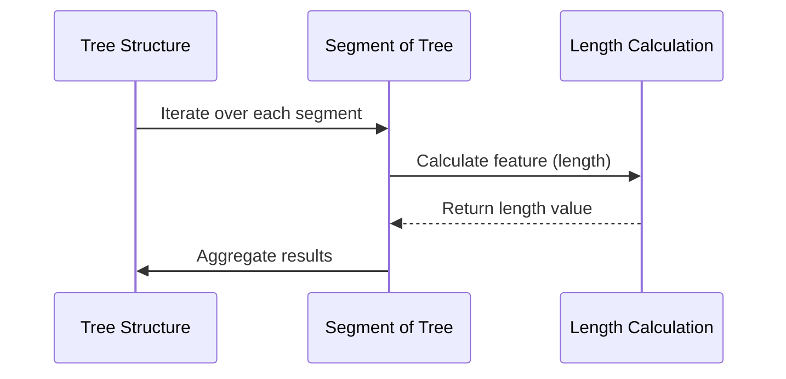

# Chapter 4: Feature Extraction in Morphological Analysis

Feature extraction in morphological analysis is akin to identifying and understanding various parts of an organism's structure. Imagine you are examining the branches of a tree—each branch has its own characteristics, such as length and thickness. By extracting these features, we can analyze the tree's overall shape and growth patterns.

## Transition from Chapter 3: Understanding Data Structures

In [Chapter 3](previous_chapter_filename.md), we delved into organizing our data structures to model biological trees effectively. Now, we build upon that foundation by focusing on how to extract meaningful features from these structures.

## Motivation for Feature Extraction

Feature extraction is crucial because it allows us to quantify and analyze complex structures in a simplified form. For instance, when studying neuron morphologies, extracting features like branch lengths or diameters helps scientists understand neural connectivity and function.

### Key Concepts

1. **Sections and Segments**: Think of a tree as being divided into sections (branches) and segments (sub-parts of branches). Each section has specific properties we can measure.
   
2. **Feature Functions**: These are tools that help us extract particular characteristics from each segment, such as length or radius.

3. **Iterative Analysis**: By iterating over these sections and applying feature functions, we can gather comprehensive data about the entire structure.

## Using Feature Extraction

Let's walk through a simple example: extracting the total length of all segments in a tree-like structure.

### Example Use Case

**Input**: A list of segment points representing a neuron's morphology.

**Output**: The total length of these segments.

```python
# Sample input: Segment points in 3D space
segment_points = [
    [(0, 0, 0), (1, 1, 1)],
    [(1, 1, 1), (2, 2, 2)],
    [(2, 2, 2), (3, 3, 3)]
]

# Function to calculate segment length
def calculate_length(points):
    total_length = 0
    for start, end in points:
        # Calculate Euclidean distance between two points
        length = ((end[0] - start[0])**2 + 
                  (end[1] - start[1])**2 + 
                  (end[2] - start[2])**2) ** 0.5
        total_length += length
    return total_length

# Calculate and print the total length
total_length = calculate_length(segment_points)
print(f"Total Length: {total_length}")
```

**Explanation**: This code calculates the Euclidean distance between each pair of points, summing them to get the total length.

## Internal Implementation

When you call a feature extraction function, it typically follows these steps:

1. **Iterate Over Segments**: The function loops through each segment in the structure.
2. **Apply Feature Function**: For each segment, a specific feature (like length) is calculated.
3. **Aggregate Results**: All individual results are combined to form a comprehensive analysis.

### Sequence Diagram



## Deeper Dive into Code

The core of feature extraction lies in the ability to iterate and apply functions efficiently. Here's a breakdown:

- **Data Structures**: Use lists or arrays to store segment points.
- **Functions**: Implement functions like `calculate_length` to handle specific calculations.
- **Aggregation**: Sum up results from each function call to get overall metrics.

### Example Code Block

```python
# Function to calculate mean radius weighted by segment lengths
def section_mean_radius(points, radii):
    lengths = np.linalg.norm(points[1:] - points[:-1], axis=1)
    mean_radii = 0.5 * (radii[1:] + radii[:-1])
    return np.sum(mean_radii * lengths) / np.sum(lengths)

# Example usage
points = np.array(segment_points)
radii = [0.5, 0.6, 0.7]
mean_radius = section_mean_radius(points, radii)
print(f"Mean Radius: {mean_radius}")
```

**Explanation**: This function calculates the mean radius of a section, weighted by segment lengths.

## Conclusion

In this chapter, we explored how to extract features from morphological structures, focusing on practical examples and internal mechanisms. By understanding these concepts, you can analyze complex biological forms effectively.

As we move forward, [Chapter 5](next_chapter_filename.md) will delve into visualizing these extracted features, helping us bring our analysis to life through graphical representations.

---

Generated by [AI Codebase Knowledge Builder](https://github.com/The-Pocket/Tutorial-Codebase-Knowledge)