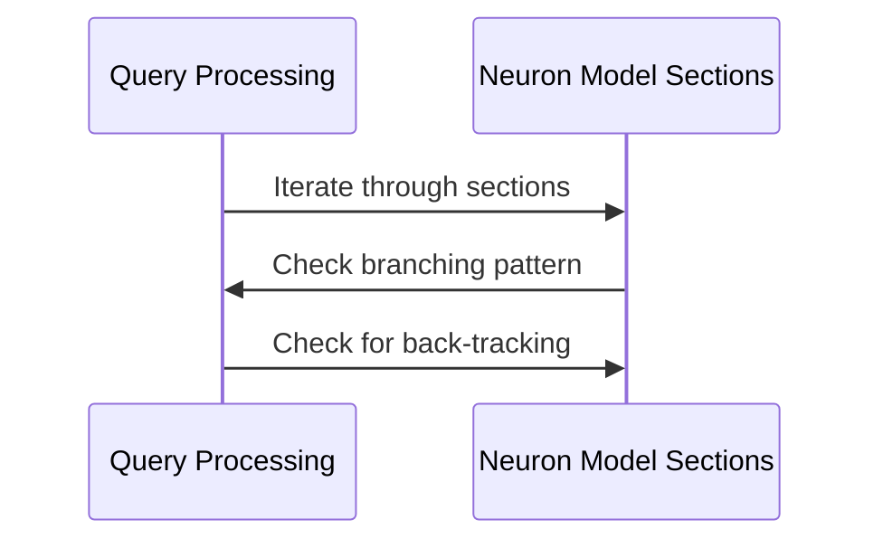

# Chapter 5: Morphological Checks

In this chapter, we dive into the fascinating world of morphological checks. These are essential techniques used to analyze and validate the structure of neurons in computational neuroscience. Whether you're a researcher exploring neural networks or a student curious about how these intricate systems function, understanding morphological checks is crucial for ensuring that models accurately represent real biological structures.

## Transition from Chapter 4

In [Chapter 4: Understanding Neuron Structures](chapter_4_neuron_structures.md), we explored the basic components and organization of neurons. Building on this foundation, we now shift our focus to assessing these structures through morphological checks, which ensure they meet specific criteria or standards.

## Motivation: Ensuring Accurate Neuronal Models

Imagine you're tasked with creating a digital model of a neuron for research purposes. The accuracy of your model is critical—after all, it serves as the foundation for further analysis and experimentation. This is where morphological checks come in. They help verify that your model adheres to expected characteristics, such as correct branching patterns, absence of anomalies like back-tracking or overlapping points, and proper segment lengths.

### Key Concepts

To understand morphological checks, let's break down a few key concepts:

1. **Branching Patterns**: Neurons have complex structures with branches (dendrites) and long extensions (axons). Checks ensure these patterns align with known biological structures.
   
2. **Back-tracking**: In some models, sections of the neuron might incorrectly loop back on themselves. Checks identify these anomalies to prevent data inaccuracies.

3. **Overlapping Points**: Neurons should have distinct points representing their structure. Overlaps can indicate errors in modeling that need correction.

4. **Section Lengths and Children**: Each segment or section of a neuron may have specific length requirements and expected numbers of child sections.

### Using Morphological Checks

To illustrate how morphological checks work, let's consider an example where we validate a neuron model using several checks:

```python
# Check for correct branching patterns
branch_check = has_multifurcation(neuron_model)
print(branch_check)  # Output: CheckResult indicating if multifurcations are present

# Ensure no back-tracking in sections
back_track_check = has_no_back_tracking(neuron_model)
print(back_track_check)  # Output: CheckResult indicating presence of back-tracking segments
```

#### Explanation:

- **Branching Patterns**: The `has_multifurcation` function checks if any section of the neuron branches into more than three children. This helps ensure that the branching complexity is realistic.

- **Back-tracking**: The `has_no_back_tracking` function scans for sections where the structure loops back on itself, which could indicate an error in modeling or data entry.

### Internal Implementation

Let's delve deeper into how these checks operate internally. Consider the following sequence:

1. **Iterate through Neuron Sections**: The system processes each section of the neuron model.
2. **Apply Checks**: For each section, it applies specific criteria (e.g., checking for branching or back-tracking).
3. **Collect Results**: Any deviations from expected structures are recorded as "bad IDs" with details on the anomaly.

Here's a simplified view using pseudocode:



#### Detailed Code Walkthrough:

For example, the `has_multifurcation` function might look like this in practice:

```python
def has_multifurcation(neuron):
    """Check if a section has more than 3 children."""
    bad_ids = [
        (section.id, section.points[np.newaxis, -1])
        for section in iter_sections(neuron)
        if len(section.children) > 3
    ]
    return CheckResult(len(bad_ids) == 0, bad_ids)

# Explanation:
# - `iter_sections(neuron)` loops through each section.
# - Each section's children are counted with `len(section.children)`.
# - Sections with more than three children are flagged as "bad IDs".
```

### Conclusion

Through this chapter, we've explored the essentials of morphological checks and their importance in ensuring accurate neuron models. By applying these checks, researchers can validate that their models meet expected structural criteria, paving the way for reliable experiments and discoveries.

As we move forward, the next step is to explore how these validated structures can be utilized in larger-scale neural network simulations. Stay tuned as we dive deeper into this exciting journey in [Chapter 6: Neural Network Simulations](chapter_6_neural_network_simulations.md).

Remember, mastering morphological checks not only strengthens your foundational knowledge but also equips you with the tools needed to build and analyze complex neuronal models accurately!

---

Generated by [AI Codebase Knowledge Builder](https://github.com/The-Pocket/Tutorial-Codebase-Knowledge)