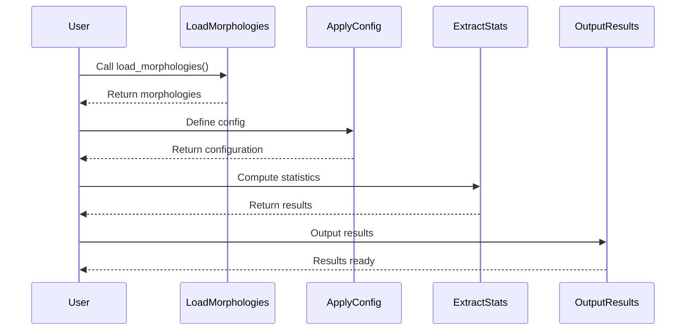

# Chapter 6: Statistical Analysis of Morphologies

In this chapter, we delve into the fascinating world of statistical analysis applied to morphological data. Building on our understanding from [Chapter 5: Data Loading and Preprocessing](previous_chapter_filename.md), where we learned how to load and preprocess morphology files, we now focus on extracting meaningful statistics that can help us understand these complex structures better.

## Motivation

Imagine you're a biologist studying the structure of neurons. You have hundreds of neuron morphologies stored as data files, each representing a unique shape and form. Your goal is to analyze this vast dataset to find patterns, compare different neuron types, or even classify them based on their structural characteristics. This is where statistical analysis comes in—it allows you to quantify these differences and similarities systematically.

### Central Use Case

Let's consider a concrete example: You want to analyze the distribution of neurite lengths across different neurons in your dataset. By doing so, you can identify if certain neuron types tend to have longer or shorter neurites, which might be linked to their function.

## Key Concepts

To achieve our goal, we need to understand several key concepts:

1. **Morphologies**: These are the structural representations of biological entities (like neurons) stored in files.
2. **Statistics Configuration**: A set of rules that define what statistics to compute and how to interpret different parts of a morphology.
3. **Data Processing Pipeline**: The sequence of steps involved in loading, processing, and analyzing morphological data.

### Morphologies

Morphologies are essentially graphs where nodes represent points in space (like the end of a neurite), and edges represent connections between these points. Each morphology can be thought of as a unique "shape" that we want to analyze.

### Statistics Configuration

A statistics configuration is like a recipe that tells our analysis tool what ingredients (data points) to consider and how to mix them together to produce meaningful results. For instance, it might specify that we should calculate the average length of all neurites in each morphology.

### Data Processing Pipeline

This pipeline involves several steps:
1. **Loading**: Reading morphology files from a directory.
2. **Processing**: Applying any necessary transformations or filters (e.g., ignoring certain exceptions).
3. **Analyzing**: Computing statistics based on the configuration provided.

## Using the Abstraction

Let's walk through how we can use this abstraction to solve our central use case—analyzing neurite lengths.

### Step 1: Load Morphologies

We start by loading all morphology files from a specified directory. This is done using the `nm.load_morphologies` function, which handles reading the files and converting them into a format we can work with.

```python
morphs = nm.load_morphologies(
    get_files_by_path(datapath),
    ignored_exceptions=tuple(IGNORABLE_EXCEPTIONS[k] for k in ignored_exceptions),
    process_subtrees=use_subtrees,
)
```

### Step 2: Define Configuration

Next, we define our statistics configuration. This can be a custom configuration or a full one that includes all possible features and modes.

```python
config = full_config() if is_full_config else get_config(config, EXAMPLE_STATS_CONFIG)
```

### Step 3: Extract Statistics

With our morphologies loaded and configuration set, we extract the desired statistics using the `extract_stats` function. This function iterates over each morphology and computes the specified metrics.

```python
results = {m.name: extract_stats(m, config) for m in morphs}
```

### Step 4: Output Results

Finally, we output our results either to a file or print them directly. The format can be JSON or CSV, depending on your needs.

```python
if not output_file:
    print(json.dumps(results, indent=2, separators=(',', ':'), cls=NeuromJSON))
elif output_file.endswith('.json'):
    with open(output_file, 'w') as f:
        json.dump(results, f, cls=NeuromJSON)
else:
    with open(output_file, 'w') as f:
        csvwriter = csv.writer(f)
        header = _get_header(results)
        csvwriter.writerow(header)
        for line in _generate_flattened_dict(header, dict(results)):
            csvwriter.writerow(line)
```

## Internal Implementation

### Sequence Diagram Overview

Let's break down what happens when we call our main function to perform the analysis:

1. **Load Morphologies**: Reads files and converts them into a processable format.
2. **Apply Configuration**: Uses the provided configuration to determine which statistics to compute.
3. **Compute Statistics**: Iterates over each morphology, applying the configuration rules.
4. **Output Results**: Formats and writes the results to the specified output.



### Detailed Steps

1. **Loading**: The `nm.load_morphologies` function reads each file, applies any necessary preprocessing (like ignoring exceptions), and converts the data into a format suitable for analysis.

2. **Configuration**: Depending on whether we want a full configuration or a custom one, we either load a predefined set of rules (`full_config`) or use a user-defined configuration (`get_config`).

3. **Analysis**: The `extract_stats` function iterates over each morphology in our dataset. For each morphology, it applies the rules specified in our configuration to compute various statistics.

4. **Output**: Finally, we format our results according to the desired output format (JSON or CSV) and write them to a file or print them directly.

## Conclusion

By following these steps, you can systematically analyze morphological data and extract meaningful insights. This process not only helps in understanding individual structures but also allows for comparative studies across different datasets.

In the next chapter, we will explore advanced techniques for visualizing our statistical findings, further enhancing our ability to interpret complex biological data.

Stay tuned for [Chapter 7: Visualization of Morphological Data](next_chapter_filename.md).

---

Generated by [AI Codebase Knowledge Builder](https://github.com/The-Pocket/Tutorial-Codebase-Knowledge)