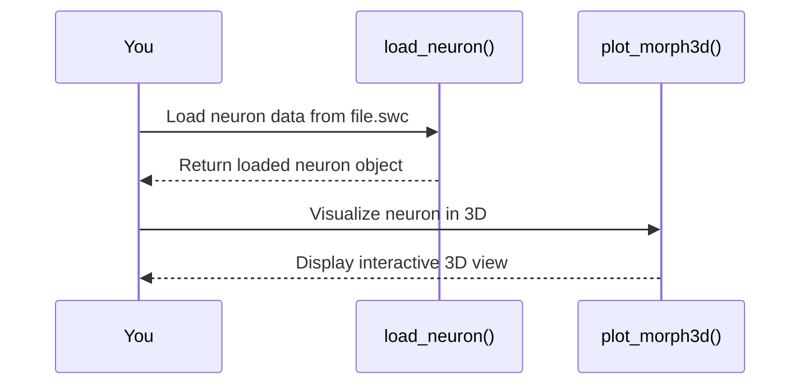

# Chapter 7: Visualization Tools

In our journey of exploring neuroinformatics with NeuroM, we've built up a strong foundation on how to work with and manipulate neuron morphology data. With these tools at our disposal, it's time to bring the static structures we have worked with to life through visualization. Just like viewing a photograph gives us insight into a moment in time, visualizing neuron morphologies can provide us an understanding of their complex structures.

## Getting Started with Visualization

NeuroM offers robust visualization capabilities that allow researchers and enthusiasts alike to see neuron morphologies both in 2D and 3D. These tools are instrumental when you need to present your data or simply want a better grasp of the intricate details within neuronal structures. Let's explore how easy it is to bring these visualizations into existence with NeuroM.

### Key Concepts

Before diving into visualization, let’s understand some key components:

1. **Plotting 2D Morphologies**: This provides an overhead view where you can see the branching patterns of neurons.
2. **3D Visualization**: Allows exploration of neuron structures in three dimensions, giving depth to our understanding.
3. **Morphology Dendrogram**: A tree-like diagram that shows how different sections of a neuron are related.

Each of these components serves as a powerful tool for analyzing and sharing your work with others or simply enhancing your understanding.

## How to Visualize Morphologies

Let's start by visualizing a simple 2D morphology. Suppose we have a neuron's data loaded in NeuroM, our goal is to generate a visual representation of it.

### Plotting a 2D Morphology

To create a 2D plot of a neuron:

```python
from neurom import load_neuron
from neurom.view import plot_morph

# Load your neuron data
neuron = load_neuron('path/to/your/neuron/file.swc')

# Create a 2D visualization
plot_morph(neuron)
```

This will render an image showing the branching structure of your neuron in a plane. It's straightforward and requires minimal setup, making it beginner-friendly.

### Visualizing in 3D

For those who want to delve deeper into the morphology:

```python
from neurom import load_neuron
from neurom.view import plot_morph3d

# Load your neuron data
neuron = load_neuron('path/to/your/neuron/file.swc')

# Create a 3D visualization
plot_morph3d(neuron)
```

Executing this will open an interactive window where you can rotate and zoom into the morphology, exploring its three-dimensional structure.

### Understanding Structure with Dendrograms

To see how different parts of the neuron are connected:

```python
from neurom import load_neuron
from neurom.view import plot_dendrogram

# Load your neuron data
neuron = load_neuron('path/to/your/neuron/file.swc')

# Plot a dendrogram
plot_dendrogram(neuron)
```

This will display a tree diagram, highlighting the hierarchical relationship of neuronal segments.

## Behind the Scenes: How Visualization Works

Let's walk through what happens when you call these visualization functions:

1. **Loading Data**: The neuron data is loaded from your file using `load_neuron`.
2. **Data Processing**: NeuroM processes this data to understand its structure.
3. **Plotting**:
   - For 2D plots, the `plot_morph` function uses matplotlib (a popular Python plotting library) to render the morphology on a 2D plane.
   - In 3D visualizations, `plot_morph3d` leverages libraries like Mayavi for rendering interactive three-dimensional scenes.
   - The dendrogram is plotted using tree structures, often represented with hierarchical clustering algorithms.

These steps are abstracted away from you, allowing easy access to complex functionalities through simple function calls.

## Deep Dive into Implementation

The implementation of these visualization tools can be found in `neurom/view/__init__.py`. Here's a simplified look at how each function might work:

### Sequence Diagram for 3D Visualization



### Simplified Code Walkthrough

In `plot_morph3d`:

- **Initialize a 3D viewer**: Sets up the environment for rendering.
- **Iterate through sections**: Loops over each section of the neuron to plot it in 3D space.
- **Render and display**: Uses visualization libraries to bring everything together and present it interactively.

These steps are condensed into clean, high-level function calls that hide the complexity from you as a user.

## Conclusion

With NeuroM's visualization tools, you can easily transform your neuron data into insightful visuals. Whether you're presenting findings or exploring new insights, these visualizations can serve as powerful aids in understanding and communicating complex neuronal structures.

As we continue our exploration of neuroinformatics, stay tuned for more advanced topics that will further enhance your toolkit!

--- 

Stay engaged with the community and share your visualizations! Let's push the boundaries of what we can understand about neuron morphology together. For further learning, refer to documentation or community forums on [NeuroM](https://neurom.io). Happy Visualizing!

---

Generated by [AI Codebase Knowledge Builder](https://github.com/The-Pocket/Tutorial-Codebase-Knowledge)