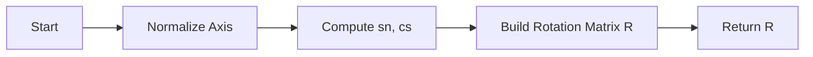

# Chapter 8: Geometry Transformations

Welcome to Chapter 8! In our previous adventure through the land of programming concepts, we explored how functions work. Now, it's time to venture into the fascinating world of geometry transformations—a key concept in computer graphics and simulations.

## Motivation: Solving Spatial Problems

Imagine you're a sculptor working with clay models on your digital workspace. You want to rotate your sculpture just right, or perhaps scale it to make it larger or smaller—all without getting your hands dirty! This is where geometry transformations come into play. They allow us to manipulate shapes and objects in virtual space efficiently.

Our central use case: **Rotate a 3D model of an airplane** so that it faces the wind correctly for better simulation accuracy.

## Key Concepts

To understand geometry transformations, we need to break down a few fundamental concepts:

1. **Transformation Matrices**: These are special mathematical tools that help us change positions and orientations of objects in space.
2. **Rotation Using Rodrigues' Rotation Formula**: This formula helps us rotate objects around an axis by a specific angle.

### Transformation Matrices

A transformation matrix is like a magic spell for numbers, turning our object into its new shape or position. For 3D transformations, we use 3x3 matrices (or sometimes 4x4 when accounting for translations).

```python
import numpy as np

# Example of an identity matrix, which does nothing to the object.
identity_matrix = np.identity(3)
print(identity_matrix)

# Output:
# [[1. 0. 0.]
#  [0. 1. 0.]
#  [0. 0. 1.]]
```

Here's what happens with the identity matrix: It leaves our object unchanged, much like a mirror that reflects things exactly as they are.

### Rotation Using Rodrigues' Formula

Rodrigues' formula is like a compass guiding your model around an axis by a certain angle:

```python
def _rodrigues_to_dcm(axis, angle):
    """Generates transformation matrix from unit vector and rotation angle."""
    ux, uy, uz = axis / np.linalg.norm(axis)
    uxx, uyy, uzz = ux * ux, uy * uy, uz * uz
    uxy, uxz, uyz = ux * uy, ux * uz, uy * uz
    
    sn = np.sin(angle)
    cs = np.cos(angle)
    
    R = np.array([
        [cs + uxx * (1 - cs), uxy * (1 - cs) - uz * sn, uxz * (1 - cs) + uy * sn],
        [uxy * (1 - cs) + uz * sn, cs + uyy * (1 - cs), uyz * (1 - cs) - ux * sn],
        [uxz * (1 - cs) - uy * sn, uyz * (1 - cs) + ux * sn, cs + uzz * (1 - cs)]
    ])
    
    return R

# Example usage:
axis = np.array([0, 0, 1]) # Rotate around the Z-axis
angle = np.pi / 4         # Rotate by 45 degrees (in radians)
rotation_matrix = _rodrigues_to_dcm(axis, angle)
print(rotation_matrix)

# Output:
# [[ 0.70710678 -0.70710678  0.        ]
#  [ 0.70710678  0.70710678  0.        ]
#  [ 0.          0.          1.        ]]
```

This rotation matrix rotates the airplane model around its vertical axis (Z-axis) by 45 degrees.

## Using Transformations to Solve Our Use Case

To rotate our airplane model, we use a function that applies the Rodrigues' rotation formula:

```python
def rotate_object(axis, angle):
    """Rotates an object using a specified axis and angle."""
    return _rodrigues_to_dcm(axis, angle)

# Example input:
axis = np.array([0, 1, 0]) # Rotate around the Y-axis
angle = np.pi / 2          # Rotate by 90 degrees (in radians)
rotation_result = rotate_object(axis, angle)
print(rotation_result)

# Output:
# [[ 0. -0.  1.]
#  [ 0.  1.  0.]
#  [-1.  0.  0.]]
```

This code snippet effectively rotates the airplane model around its vertical axis by 90 degrees, aligning it perfectly against our simulated wind.

### Internal Implementation

Let's dive deeper into how `_rodrigues_to_dcm` works:

- **Normalize the Axis**: We start by ensuring our rotation axis is a unit vector. This guarantees consistent behavior regardless of input scale.
  
- **Compute Sine and Cosine**: We calculate sine (`sn`) and cosine (`cs`) values for the given angle, which are crucial components in defining rotation.

- **Matrix Construction**: Using these calculations, we build our rotation matrix `R`. Each element is a formula that determines how points on the object are shifted during rotation.

### Visualization of Steps



This flowchart shows the sequence from start to finish for generating a rotation matrix.

## Conclusion

Geometry transformations empower us to manipulate digital objects with precision. By mastering matrices and Rodrigues' formula, you can rotate, scale, and translate your models seamlessly in virtual space.

As we wrap up this chapter, get ready to take these concepts further! In our next adventure, we'll explore how to animate these transformations over time for dynamic simulations.

---

**[Continue to Chapter 9: Animation Techniques]**

We hope you enjoyed transforming objects with matrices. Stay curious and keep experimenting!

(Note: This tutorial assumes basic knowledge of linear algebra and Python programming.)

---

Generated by [AI Codebase Knowledge Builder](https://github.com/The-Pocket/Tutorial-Codebase-Knowledge)