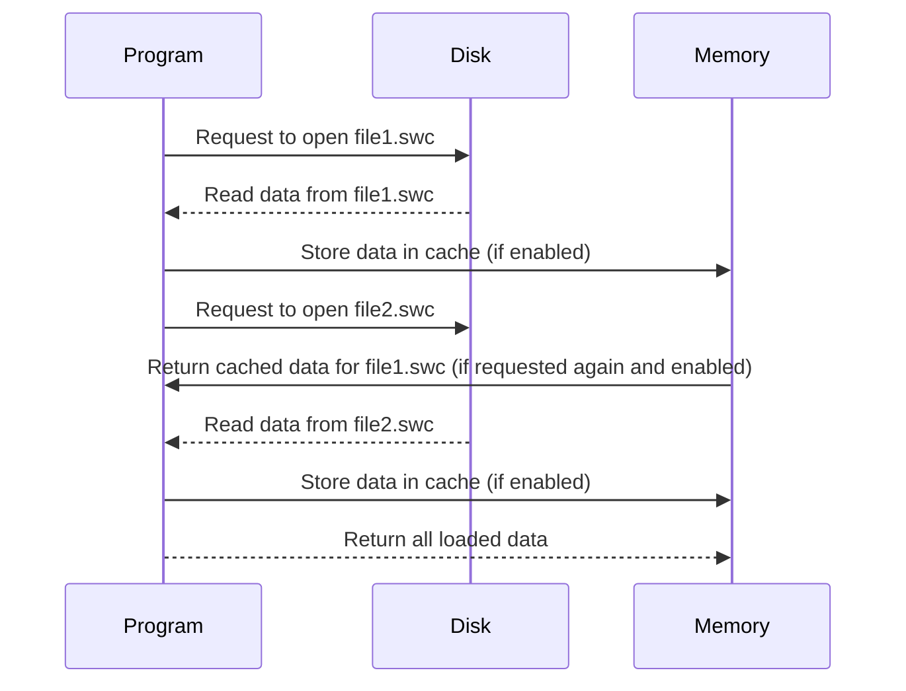

# Chapter 9: I/O Operations

In our last journey through data manipulation, we delved into [Data Structures](data_structures.md), learning how to organize and manage information efficiently. This chapter will elevate your skills by introducing you to **Input/Output (I/O) Operations**—the gateway to interacting with the world outside of our programs.

## Motivation: The Need for I/O

Imagine writing a letter without an envelope or postage. How would you send it? Similarly, a program needs ways to receive inputs and deliver outputs to be useful. Whether reading data from a file, fetching information over the internet, or displaying results to users, mastering I/O operations is crucial.

Let's consider our central use case: **Loading Morphology Data**. This task involves retrieving neuron morphology files from storage, processing them, and integrating them into a program for analysis. Sounds complex? Don't worry! We'll break it down step-by-step using Python.

## Key Concepts

1. **Files and Paths**: Understanding how to navigate directories and manipulate file paths is foundational.
2. **Reading Files**: Learning how to open and read content from files.
3. **Caching**: Storing data temporarily for efficient access.

### Concept 1: Files and Paths

Just as you need a map to find your way in a new city, programs use paths to navigate directories. In Python, the `os` and `pathlib` libraries are your guides.

```python
from pathlib import Path

# Define a directory path
morph_directory = Path("/path/to/morphologies")

# List all files in this directory
files = list(morph_directory.glob("*.swc"))

print(files)
```

**Explanation**: This code snippet finds and lists all `.swc` morphology files in the specified directory. `Path` is an object-oriented approach to handle file system paths.

### Concept 2: Reading Files

Once you've located a file, it's time to open its contents like opening a book.

```python
with morph_directory.joinpath("neuron1.swc").open() as file:
    data = file.read()

print(data)
```

**Explanation**: This code opens `neuron1.swc`, reads its content into the variable `data`, and prints it. The `with` statement ensures the file is properly closed after reading.

### Concept 3: Caching

Caching temporarily stores data to speed up repeated access, much like keeping your favorite books on a bedside table for easy reach.

```python
cache = {}

def load_morphology(file_path):
    if file_path in cache:
        return cache[file_path]
    
    with open(file_path) as f:
        morphology_data = f.read()
        cache[file_path] = morphology_data
        return morphology_data

# Usage example
morph_data = load_morphology(morph_directory / "neuron1.swc")
print(morph_data)
```

**Explanation**: This function checks if the file is already in `cache`. If not, it reads the file and stores its content in `cache` for future access.

## Solving Our Use Case: Loading Morphology Data

Let's integrate these concepts to load multiple morphology files into a program. We'll create a population of neuron morphologies.

```python
from typing import List

def load_morphologies(morphs: List[Path], cache_enabled=False) -> List[str]:
    cached_data = {} if cache_enabled else None
    loaded_data = []

    for file in morphs:
        if cache_enabled and file in cached_data:
            data = cached_data[file]
        else:
            with open(file) as f:
                data = f.read()
                if cache_enabled:
                    cached_data[file] = data
        
        loaded_data.append(data)
    
    return loaded_data

# Example usage
files_to_load = [morph_directory / "neuron1.swc", morph_directory / "neuron2.swc"]
loaded_morphs = load_morphologies(files_to_load, cache_enabled=True)

for morph in loaded_morphs:
    print(morph)
```

**Explanation**: This function takes a list of file paths and loads their contents. If `cache_enabled` is true, it caches the data for efficiency.

## Internal Implementation

### High-Level Walkthrough

1. **Input**: List of file paths.
2. **Processing**: For each file, check cache; if not present, read from disk.
3. **Output**: Return list of file contents.

#### Sequence Diagram



### Detailed Code Explanation

- **Path Handling**: Uses `pathlib` for easy path manipulations.
- **File Reading**: Uses context managers (`with`) to ensure proper file handling.
- **Caching**: Implements a simple caching mechanism using a dictionary.

## Conclusion

Congratulations! You've learned how to handle I/O operations effectively. By understanding files, reading data, and leveraging caching, you can efficiently manage external resources in your programs.

As we close this chapter, remember that mastering these skills opens doors to more complex tasks like network communication and database interactions. Stay curious, and keep experimenting!

---

**Next Steps**: Explore how [Data Structures](data_structures.md) can further optimize the storage and retrieval of loaded morphology data.

---

Generated by [AI Codebase Knowledge Builder](https://github.com/The-Pocket/Tutorial-Codebase-Knowledge)