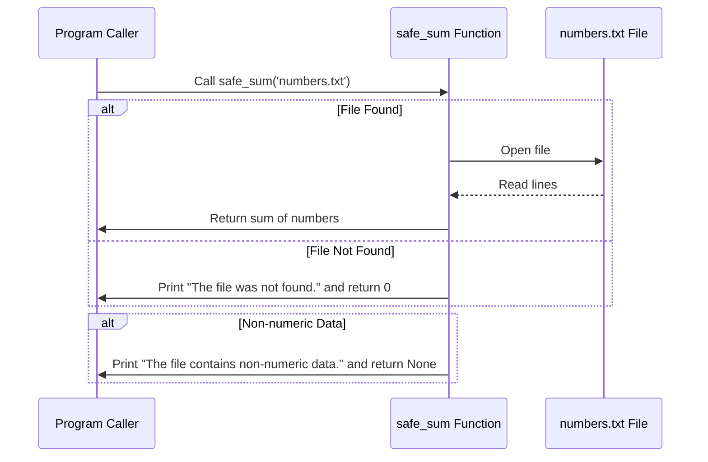

# Chapter 10: Exception Handling

In software development, managing errors gracefully is crucial to creating robust and user-friendly applications. The previous chapter covered [Data Structures](data_structures.md), focusing on organizing data efficiently. Now, we transition into understanding how exceptions allow us to handle unexpected situations elegantly without crashing our programs.

## Motivation: Why Exception Handling?

Imagine you're writing a program that reads numbers from a file and performs calculations. What happens if the file is missing or contains invalid data? Without proper error handling, your program might crash, leading to user frustration and potential data loss. This chapter introduces exception handling as a solution to manage such errors gracefully.

### Central Use Case: Reading Data Safely

Let's consider a simple use case: reading numbers from a file and calculating their sum. If the file is missing or contains non-numeric values, we want our program to handle these issues without crashing.

## Key Concepts in Exception Handling

To understand exception handling, let's break it down into key concepts:

### 1. Errors vs Exceptions

**Errors**: These are problems that arise during execution and typically indicate a bug (e.g., trying to access an index out of range).

**Exceptions**: These are events that occur during execution that disrupt the normal flow of a program but can be handled gracefully (e.g., file not found).

### 2. Try-Except Block

The `try-except` block is the cornerstone of exception handling in Python. It allows you to "try" running a block of code and "except" handle any exceptions that arise.

```python
try:
    # Code that might raise an exception
    with open('numbers.txt', 'r') as file:
        numbers = [int(line.strip()) for line in file]
except FileNotFoundError:
    print("The file was not found.")
except ValueError:
    print("The file contains non-numeric data.")
```

**Explanation**: Here, we attempt to read a file. If the file is missing (`FileNotFoundError`), or if there's invalid data (`ValueError`), our program handles these gracefully with informative messages.

### 3. Finally Block

The `finally` block ensures that certain code runs regardless of whether an exception was raised or not. It's useful for cleanup actions, like closing files.

```python
try:
    file = open('numbers.txt', 'r')
except FileNotFoundError:
    print("The file was not found.")
else:
    numbers = [int(line.strip()) for line in file]
finally:
    file.close()
```

**Explanation**: Here, `file.close()` runs whether an exception occurred or not.

## Using Exception Handling to Solve Our Use Case

Let's see how we can apply these concepts to our central use case of reading and summing numbers from a file safely.

### Example: Summing Numbers with Exception Handling

```python
def safe_sum(file_path):
    try:
        with open(file_path, 'r') as file:
            return sum(int(line.strip()) for line in file)
    except FileNotFoundError:
        print("The file was not found.")
        return 0
    except ValueError:
        print("The file contains non-numeric data.")
        return None

# Example usage
result = safe_sum('numbers.txt')
if result is not None:
    print(f"The sum of the numbers is: {result}")
```

**Explanation**: This function attempts to read and sum numbers from a specified file. It handles missing files or invalid data gracefully, returning `0` or `None` as appropriate.

## Internal Implementation Walkthrough

Let's walk through what happens step-by-step when `safe_sum` is called:

1. **Open File**: The program tries to open the file.
2. **Read and Sum**: If successful, it reads lines, converts them to integers, and calculates their sum.
3. **Handle Exceptions**:
   - If the file isn't found, it prints a message and returns `0`.
   - If non-numeric data is encountered, it prints a different message and returns `None`.
4. **Close File**: The `with` statement ensures the file is closed properly.

### Sequence Diagram



## Deeper Dive into Code

Let's explore the internal implementation of our `safe_sum` function:

```python
def safe_sum(file_path):
    try:
        with open(file_path, 'r') as file:
            # Convert each line to an integer and sum them up
            return sum(int(line.strip()) for line in file)
    except FileNotFoundError:
        print("The file was not found.")
        return 0
    except ValueError:
        print("The file contains non-numeric data.")
        return None
```

**Explanation**: The `try` block attempts to open the file and calculate the sum. If a `FileNotFoundError` or `ValueError` occurs, it is caught by the corresponding `except` block.

## Conclusion

Exception handling allows you to manage errors gracefully, improving your program's robustness and user experience. By using try-except blocks, you can handle specific exceptions like `FileNotFoundError` and `ValueError`, ensuring your program continues running smoothly even when things go wrong.

In the next chapter, we'll explore [Object-Oriented Programming](object_oriented_programming.md), building on our understanding of exception handling to create more complex and modular code.

---

Generated by [AI Codebase Knowledge Builder](https://github.com/The-Pocket/Tutorial-Codebase-Knowledge)