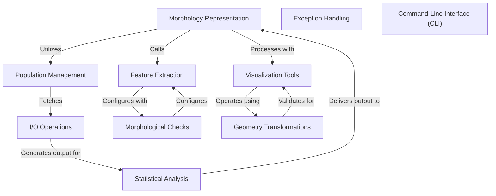

# Tutorial: neurom

This project is a tool designed for analyzing and extracting statistical information from neuronal morphology data. 
It processes input files containing morphological data (neurite structures) and generates statistics based on a user-defined configuration.
The output can be in JSON or CSV format, which includes detailed metrics about the neuron's structure. Key concepts include **configurations**, *morphologies*, 
and *statistical extraction*. The project supports both individual morphology files and collections of morphologies (populations).

**Source Repository:** [None](None)

## Chapters

1. [Command-Line Interface (CLI)
](01_command_line_interface__cli__.md)
2. [Morphology Representation
](02_morphology_representation_.md)
3. [Population Management
](03_population_management_.md)
4. [Feature Extraction
](04_feature_extraction_.md)
5. [Morphological Checks
](05_morphological_checks_.md)
6. [Statistical Analysis
](06_statistical_analysis_.md)
7. [Visualization Tools
](07_visualization_tools_.md)
8. [Geometry Transformations
](08_geometry_transformations_.md)
9. [I/O Operations
](09_i_o_operations_.md)
10. [Exception Handling
](10_exception_handling_.md)

---

Generated by [AI Codebase Knowledge Builder](https://github.com/The-Pocket/Tutorial-Codebase-Knowledge)